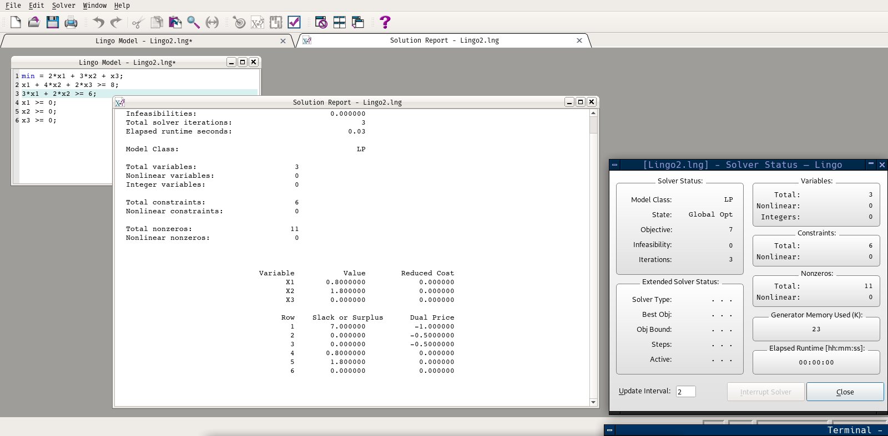

# 一、线性规划

## 1、Linear Optimization

​	用Matlab求解线性规划问题，其标准式符合下面形式。

```matlab
% f是目标函数的参数
% A,b是不等式约束（小于）的参数
% Aeq,beq是等式约束的参数
% lb和ub是x的约束
[x,fval] = linprog(f,A,b)
[x,fval] = linprog(f,A,b,Aeq,beq)
[x,fval] = linprog(f,A,b,Aeq,beq,lb,ub)
```


### lingo

​	lingo是一个需要license的软件，但是通过[这位仁兄的博客](http://sukanka.xyz/2018/02/08/Lingo/)可以了解一下使用教育邮箱不每次六个月不限次数的激活。

​	下面是一个解线性规划的例子，几乎和书写线性规划式子一样，唯二的区别是每行末要加上分号，目标函数不需要写成`max z =`的格式，只要`max即可`。




## 2、转化为线性规划问题

​	典型例子就是绝对值，通过用ui和vi分别表示|xi|和xi来转化为线性规划问题：

​	$$xi=ui-vi,|xi|=ui+vi$$


## Reference

[1].[sukanka的博客](http://sukanka.xyz/2018/02/08/Lingo/)