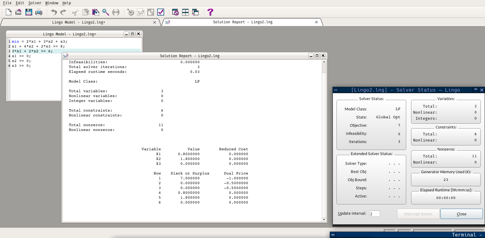

# 数学建模算法笔记

​	使用matlab、lingo、python、SPSS来计算。


## 一、线性规划

### 1、lingo做线性规划

​	用Matlab求解线性规划问题，其标准式符合下面形式。

```matlab
% f是目标函数的参数
% A,b是不等式约束（小于）的参数
% Aeq,beq是等式约束的参数
% lb和ub是x的约束
[x,fval] = linprog(f,A,b)
[x,fval] = linprog(f,A,b,Aeq,beq)
[x,fval] = linprog(f,A,b,Aeq,beq,lb,ub)
```

​	lingo是一个需要license的软件，但是通过[这位仁兄的博客](http://sukanka.xyz/2018/02/08/Lingo/)可以了解一下使用教育邮箱不每次六个月不限次数的激活。

​	下面是一个解线性规划的例子，几乎和书写线性规划式子一样，唯二的区别是每行末要加上分号，目标函数不需要写成`max z =`的格式，只要`max即可`。




### 2、转化为线性规划问题

​	典型例子就是绝对值，通过用ui和vi分别表示|xi|和xi来转化为线性规划问题：

​	$$xi=ui-vi,|xi|=ui+vi$$


## 二、整型规划

​	使用lingo中的`@gin`条件或者`@bin`（用于0-1整形规划）条件即可。


## 四、插值与拟合

### 1、插值方法

​	最初有一组形如(xi,yi)的数据，需要将点以一定规则连接起来，称为插值：

​	（1）分段插值：使用直线线性连接；

​	（2）样条插值：使用m次多项式连接，可以允许到m-1阶之内连续。

​	其中三次样条插值需要给出两个边界条件：

​	（1）$S'(a)=y'_{0},S'(b)=y'_{n}$，完备三次样条插值函数；

​	（2）$S''(a)=y''_{0},S''(b)=y''_{0}$，当全为0时为”自然边界条件“；

​	（3）$S'(a+0)=S'(b-0),S''(a+0)=S''(b-0)$，周期条件。


### 2、matlab插值工具箱

#### 2.1、一维插值函数

```matlab
% method指定插值方法：
%	'nearest'	最近插值
%	'linear'	线性插值
%	'spline'	立方样条插值
%	'cubic'		立方插值
%	'pchip'		立方插值（R2018b++）
% 所有插值方法要求x0是单调的
y = interp1(x0, y0, x, 'method')
```

#### 2.2、三次样条插值

```matlab
% 三次样条插值有几个函数可以实现
% x0,y0是数据点，x是插值点，y是插值点的函数值
y = interp1(x0, y0, x, 'spline')
y = spline(x0, y0, x)
pp = csape(x0, y0, conds)
pp = csape(x0, y0, conds, valconds); fnval(pp, x);
% valconds默认边界条件为lagrange边界条件
% conds指的是上面提到的不同情况
%	'complete'		边界为一阶导数
%	'not-a-knot'	非纽结条件
%	'periodic'		周期条件
%	'second'		边界为二阶导数
% 	'variational'	设置边界的二阶导数值为[0,0]
```

```matlab
% 《数学建模算法与应用》例5.1 P88
x0 = [0 3 5 7 9 11 12 13 14 15];
y0 = [1 1.2 1.7 2.0 2.1 2.0 1.8 1.2 1.0 1.6];
x = 0:0.1:15;

y1 = interp1(x0, y0, x);
y2 = interp1(x0, y0, x, 'spline');
pp1 = csape(x0, y0);
y3 = fnval(pp1, x);
pp2 = csape(x0, y0, 'second');
y4 = fnval(pp2, x);

[x', y1', y2', y3', y4']

subplot(1,3,1)
plot(x0, y0, '+', x, y1)
title('Piecewise linear')

subplot(1,3,2)
plot(x0, y0, '+', x, y2)
title('Spline1')

subplot(1,3,3)
plot(x0, y0, '+', x, y3)
title('Spline2')

dx = diff(x);
dy = diff(y3);
dy_dx = dy./dx;
dy_dx0 = dy_dx(1)
ytemp = y3(131:151);
ymin = min(ytemp);
index = find(y3 == ymin);
xmin = x(index);
[xmin,ymin]
```

#### 2.3、二维插值

​	即在二元函数上插值。

```matlab
% x0为m维向量，y0为n维向量，则z0就要求为m*n矩阵
% 网格节点插值
z = interp2(x0,y0,z0,x,y,'method')
% 三次样条插值
pp = csape({x0,y0}, z0, conds, valconds),
z = fnval(pp, {x,y})
% 使用散乱的插值点
ZI = griddata(x, y, z, XI, YI)
```


### 3、曲线拟合

​	使用一组线性无关函数ri在一定条件下和数据点最为接近。

​	$$f(x)=a_{1}r_{1}(x)+a_{2}r_{2}(x)+...+a_{m}r_{m}(x)$$

#### 3.1、matlab最小二乘法

##### 3.1.1、解方程组

​	$$R=\begin{bmatrix}r_{1}(x_{1})&...&r_{m}(x_{1})\\...& &...\\r_{1}(x_{n})&...&r_{m}(x_{n})\end{bmatrix}$$

​	$$A = [a_{1},...,a_{m}],Y=[y_{1},...,y_{m}]$$

​	$$J(a_{1},...,a_{m})=||RA-Y||_{2}^{2}$$

​	$$min_{A}||RA-Y||_{2}^{2}$$

##### 3.1.2、多项式拟合

```matlab
% 用m阶多项式拟合曲线
a = polyfit(x0, y0, m)
```


#### 3.2、最小二乘优化

​	一些特殊情况，比如若干函数的平方和最小化

​	$$F(x)=\sum ^{m}_{i=1}f^{2}_{i}(x),x=[x_{1},..,x_{n}]^{T}$$

​	对形如下面的目标函数：

（1）$$x=argmin_{x}||Cx-d||_{2}^{2}$$

```matlab
x = lsqlin(C,d,A,b,Aeq,beq,lb,ub)
```


（2）$$ x = argmin_{x}||F(x,x_{data})-y_{data}||_{2}^{2}=\sum_{i}(F(x,x_{data})-y_{data})^{2}$$

​	给定输入输出序列x0、y0，求参量k使得上面的目标函数最小。

```matlab
% fun是定义F(x,xdata)的函数
x = lsqcurvefit(fun,x0,xdata,ydata,lb,ub,options)
```

```matlab
% 《数学建模算法与应用》例5.8
% fun1.m 给出拟合函数的定义
function f = fun1(k,x);
f = exp(-k(1)*x(:,1)).*sin(k(2)*x(:,2))+x(:,3).^2;

% main.m
clc, clear
a = textread('data.txt');
y0 = a(:,[1])
x0 = a(:,[2:4])
k0 = rand(2,1);	% 参数初始化
lb = zeros(2,1);
ub = [20;2];
k = lsqcurvefit(@ fun1, k0, x0, y0, lb, ub)
```


（3）$$x = argmin_{x}||F(x)||_{2}^{2}$$

```matlab
x = lsqnonlin(fun,x0,lb,ub)
```


（4）$$min_{x}||Cx-d||^{2}_{2}$$，要求x非负

```matlab
x = lsqnonneg(C,d,options)
```


### 4、曲线拟合与函数逼近


## 五、微分方程


## 六、数理统计


## 七、时间序列


## 八、SVM


## 九、多元分析


## 十、现代优化算法

### 1、模拟退火


### 2、遗传算法


### 3、蚁群算法


### 4、粒子群算法


## 十一、数字图像处理


## 十二、综合评价方法


## 十三、预测方法


## 十四、目标规划


## Reference

[1].[sukanka的博客](http://sukanka.xyz/2018/02/08/Lingo/)