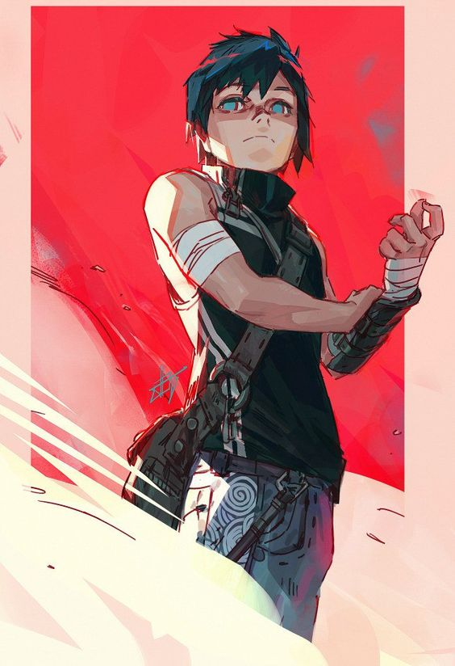

|名字|种族|身高|体重|年龄|体型调整|家乡重力|总点数|未使用|
|:-:|:-:|:-:|:-:|:-:|:-:|:-:|:-:|:-:|
|弗洛特|天人|180cm|45kg|24|0|1G|117||

|形象|
|:-:|
| |

|外貌|
|:-:|
|深蓝色的瞳孔和短发，表情比较严肃；做事非常严谨。|

|背景|
|:-:|
||

|ST|DX|IQ|HT|HP|Will|Per|FP|
|:-:|:-:|:-:|:-:|:-:|:-:|:-:|:-:|
|8 [-20]|11 [+20]|12 [+40]|10[0]|8 [0]|11[0]|11 [0]|10 [0]|

|基本举力|基本速度|基本移动|刺击|挥击|DR|招架|格挡|
|:-:|:-:|:-:|:-:|:-:|:-:|:-:|:-:|
|13|5.25 [0]|5 [0]|1d-3|1d-2|0|？|？|

|负重|负重值lb|移动|移动值|闪避|闪避值|
|:-:|:-:|:-:|:-:|:-:|:-:|
|None(0)=BL|13|BM×1|5|Dodge|8|
|Light(1)=2×BL|26|BM×0.8|4|dodge-1|7|
|Medium(2)=3×BL|39|BM×0.6|3|dodge-2|6|
|Heavy(3)=6×BL|78|BM×0.4|2|dodge-3|5|
|X-Heavy(4)=10×BL|130|BM×0.2|1|dodge-4|4|

|语言|说|写|点数|
|:--|:-:|:-:|:-:|
|汉语（母语）|完美（普通）|完美（简体）|[0]|
|英语|流利（美式）|流利|[+4]|

|文化熟悉|点数|
|:-|:-:|
|中国|[0]|
|邓肯|[+2]|

|外貌|地位|声誉|
|:-:|:-:|:-:|
|+1|0|N|

|优势&小优点|点数|
|:-|:-:|
|天人：长寿|[+2]|
|天人：吸引力| [+4] |
|天人：可抓握脚趾|[+7]|
|天人：绝对空间感|[+10]|
|天人：抵抗力（疾病）| [+10] |
|天人：辐射抵抗（/5）|[+10]|
|天人：零重力不衰弱|[+3]|
|数学天才（2）|[+20]|
|独立收入来源（5%）|[+5]|
|勤于整理|[+1]|

|劣势&小毛病|点数|
|:-|:-:|
|天人：瘦|[-5]|
|诚信|[-10]|
|失眠（轻微）|[-10]|
|职责（相当频繁，安全）|[-5]|
|工作狂|[-5]|
|接受异类|[-1]|

|技能|等级|Relative Level|Points|
|:-|:-|:-|:-:|
|宇航员IQ|13（+1）||[+2]|
|自由落体DX|15（+2）||[+8]|
|电脑编程IQ|（）||[+4]|
|核物理学IQ|13（-1）||[+4]|
|应用数学IQ|13（-1）|工程学-5、物理学-5|[+2]|
|聚变动力工程IQ|19（+6）|核动力工程-2、动力工程-4、修理-6|[+20]|
|金融IQ|10（-2）||[+1]|
|马克思主义哲学IQ|10（-2）||[+1]|

|近战|伤害|触及|招架|Notes|CW|
|:-|:-:|:-:|:-:|:-:|:-:|
|匕首||||||

|远程|伤害|Acc|范围|RoF|Shoot|ST|Bulk|Rcl|LC|Notes|CW|
|:-|:-:|:-:|:-:|:-:|:-:|:-:|:-:|:-:|:-:|:-:|:-:|
||||||||||||1|

|物品&财产|位置|CW|
|:-|:-:|:-:|
|别墅|火星中国||

|属性速度移动点数|优势点数|劣势点数|技能点数|语言&文化|其他|
|:-:|:-:|:-:|:-:|:-:|:-:|
|+60/-20|+61|-36|+46|+6|0|
